# CMPT 361 - Homework 2: Feature Detection, Matching, and Panorama Stitching

## Overview

This project implements FAST and FASTR feature detectors, feature matching using ORB descriptors, and panorama creation using RANSAC-based homography estimation. The assignment demonstrates the full pipeline from feature detection to panorama stitching on multiple image sets.

## Features

- **FAST Detector**: Efficient corner detection using the FAST algorithm.
- **FASTR Detector**: FAST with Harris cornerness and non-maximal suppression for robust feature selection.
- **Feature Matching**: ORB descriptors and feature matching between image pairs.
- **Homography Estimation**: RANSAC-based estimation for robust image alignment.
- **Panorama Creation**: Warping and blending of multiple images into a seamless panorama.
- **Batch Conversion**: JPEG to PNG conversion utility for dataset preparation.

## File Structure

- `A2Code.m` - Main script to run all experiments and generate results.
- `my_fast_detector.m` - FAST feature detector implementation.
- `my_fastr_detector.m` - FASTR (FAST + Harris) feature detector.
- `feature_match.m` - Feature matching using ORB descriptors.
- `compute_homography.m` - RANSAC-based homography estimation.
- `create_panorama4.m` - Panorama creation for 2 or more images.
- `convert_all_to_png.m` - Converts all JPEG images in the folder to PNG.
- `format_image.m` - Preprocessing and formatting of images.
- `non_maximal_suppression.m` - Non-maximal suppression for feature selection.
- `fast_tester.m` - Timing and comparison of FAST and FASTR detectors.
- `README.md` - This file.

## Requirements

- MATLAB (tested on R2022a or later)
- Image Processing Toolbox
- Computer Vision Toolbox

## Usage

1. **Prepare Images**  
   Place your input images (JPG or PNG) in the project folder.

2. **Convert Images (if needed)**  
   Run the JPEG-to-PNG conversion script:
   ```matlab
   convert_all_to_png();
   ```

3. **Run the Main Script**  
   Open and run `A2Code.m` in MATLAB:
   ```matlab
   A2Code
   ```

4. **Results**  
   Output images (feature visualizations, matches, panoramas) will be saved in the project folder.

## Results

### Feature Detection

| FAST Detector | FASTR Detector |
|:-------------:|:-------------:|
| 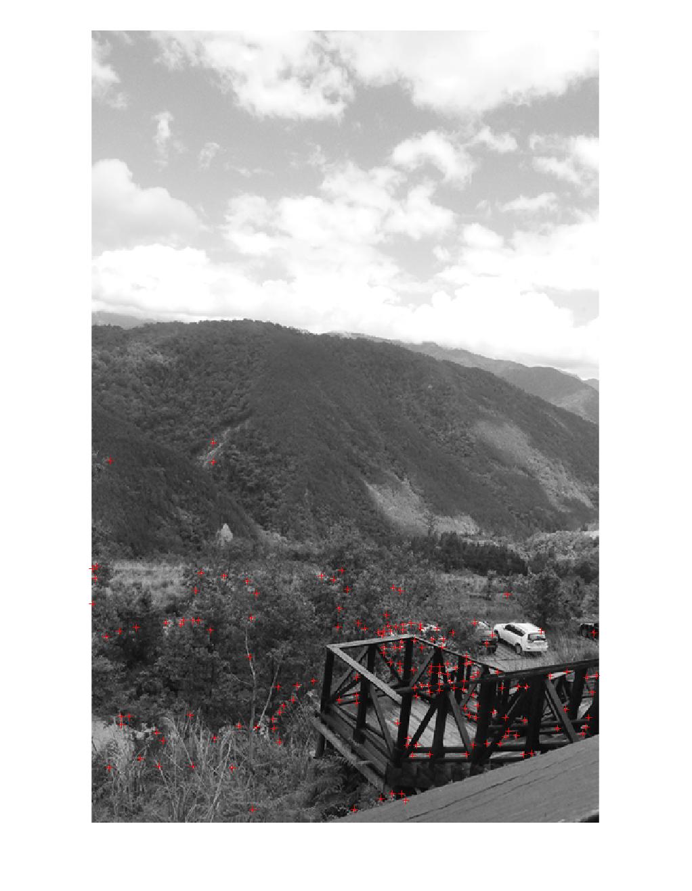 | 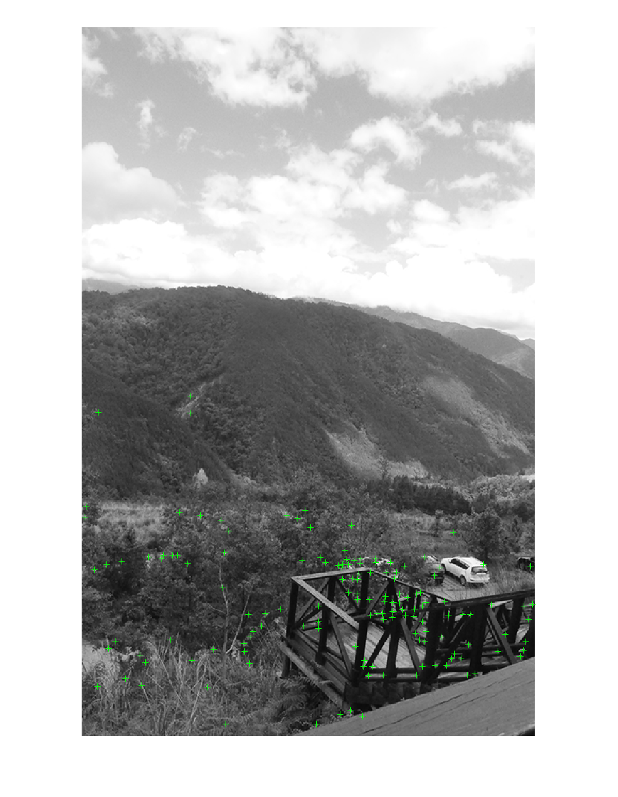 |
| 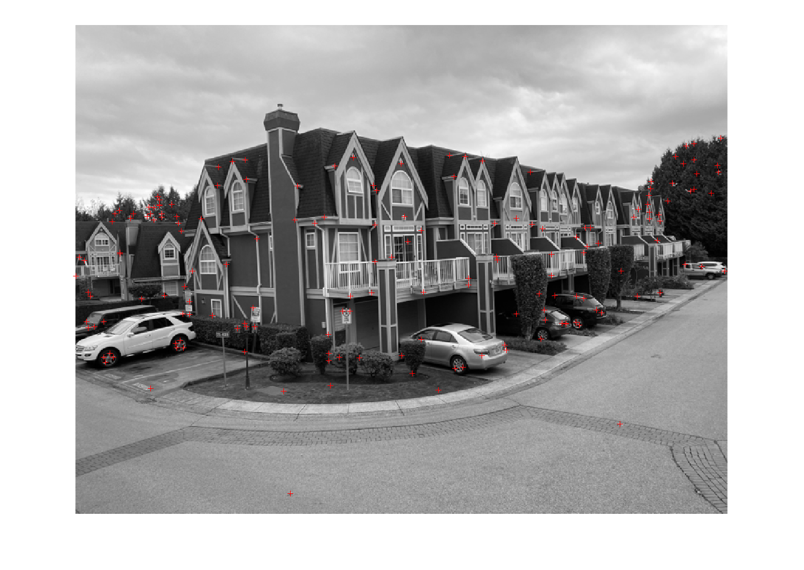 | 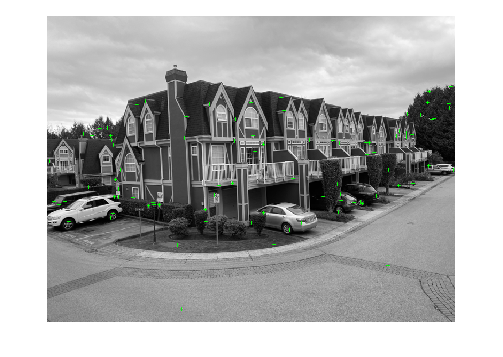 |

### Feature Matching

| FAST Match | FASTR Match |
|:----------:|:-----------:|
| 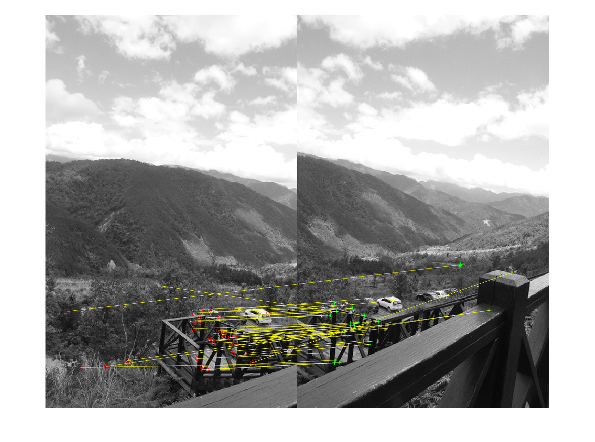 | 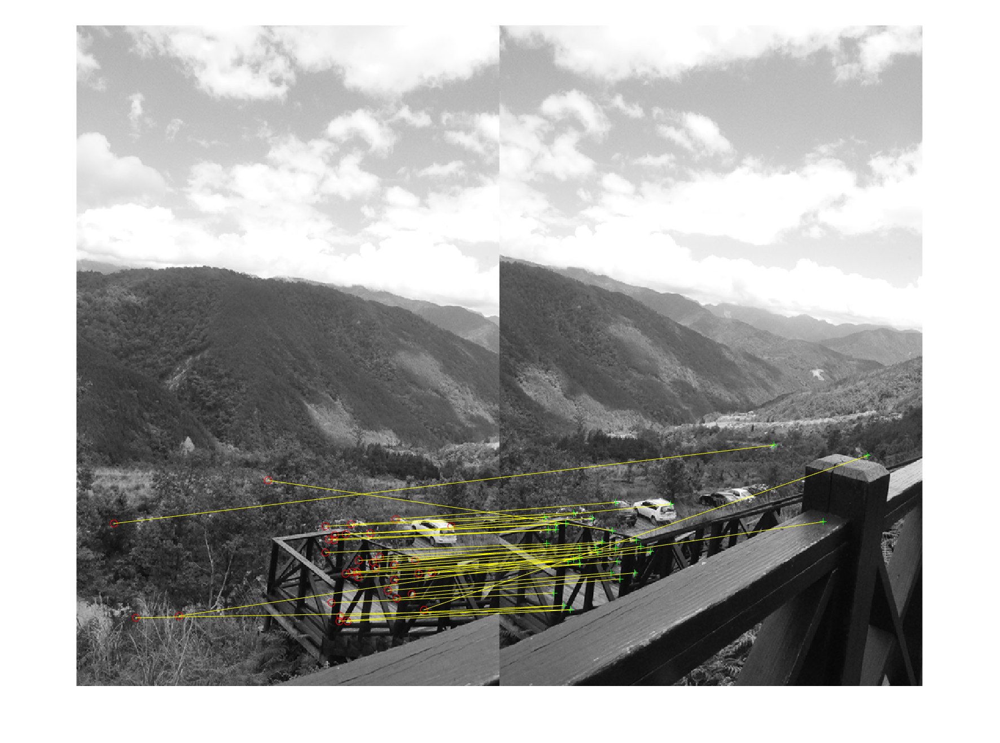 |
| 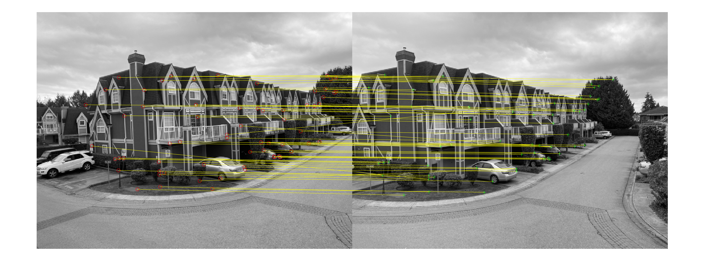 |  |

### Panoramas

| Set | Panorama |
|-----|----------|
| S1  | 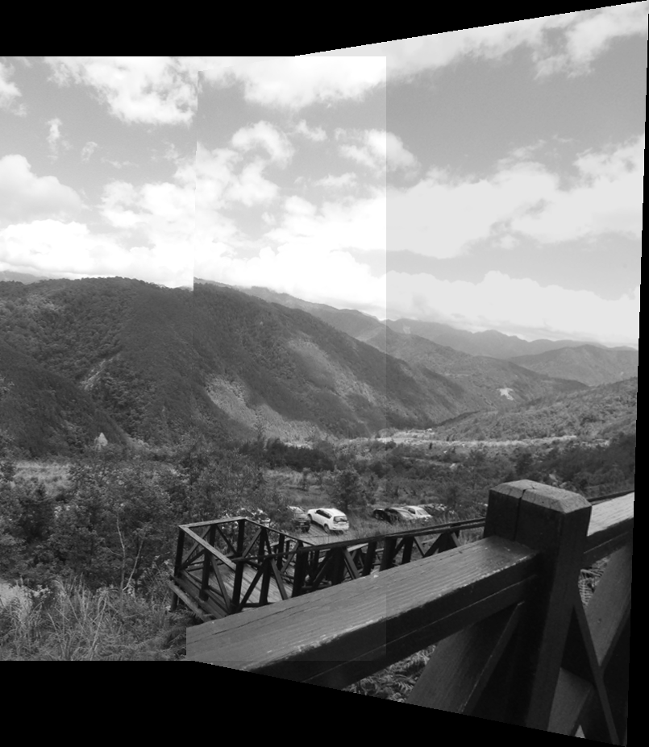 |
| S2  | 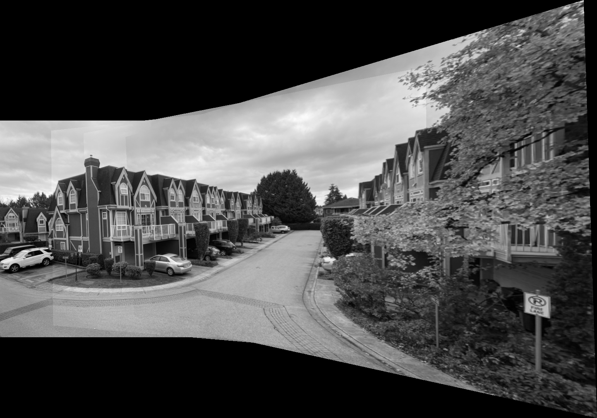 |
| S3  | 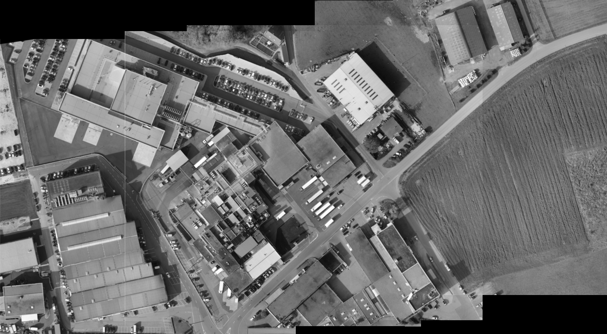 |
| S4  | 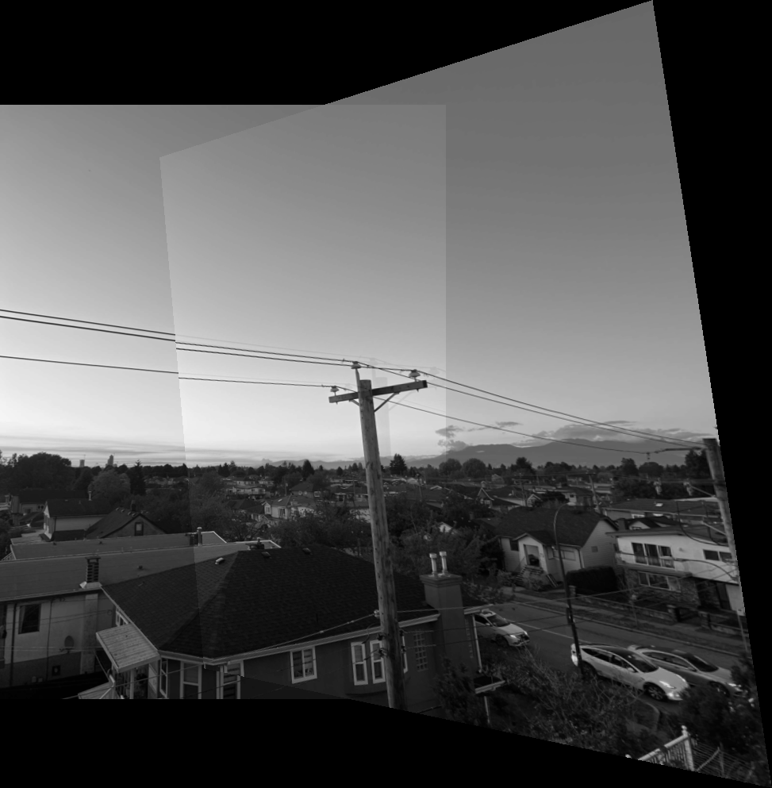 |

> **Note:** Place your result images in a `results/` folder or update the paths above as needed.

## What I Did

- Implemented FAST and FASTR detectors from scratch.
- Used ORB descriptors for robust feature matching.
- Estimated homographies using RANSAC for outlier rejection.
- Created panoramas by warping and blending multiple images.
- Compared performance and accuracy of FAST vs FASTR.
- Documented results and analysis in [CMPT 361 HW2 - Banpreet Aulakh.htm](CMPT%20361%20HW2%20-%20Banpreet%20Aulakh.htm).

## Credits

- S3 dataset: [Kaggle - images-data by deepzsenu](https://www.kaggle.com/datasets/deepzsenu/images-data?resource=download)
- Assignment by CMPT 361, Simon Fraser University

---

*Banpreet Aulakh, 2024*